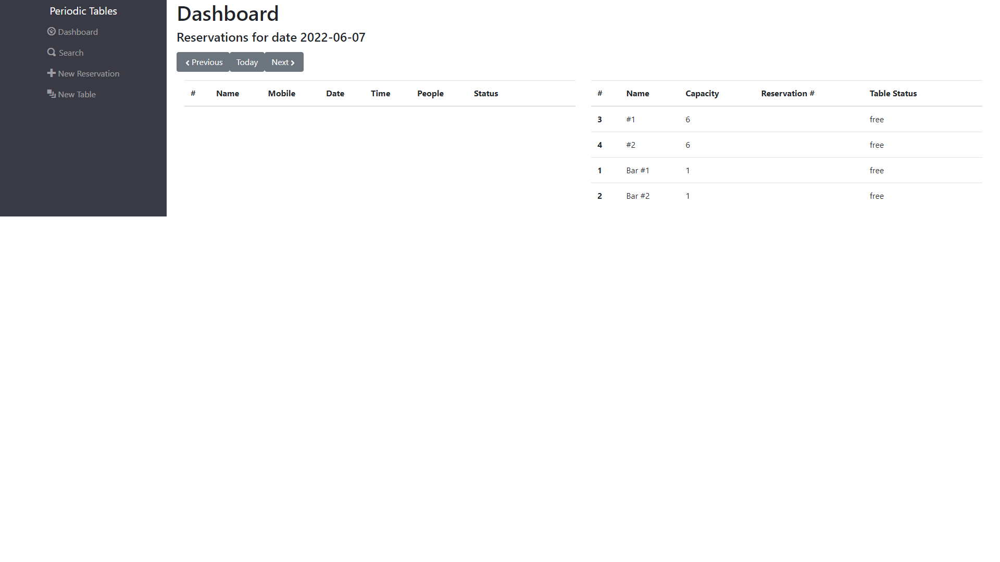
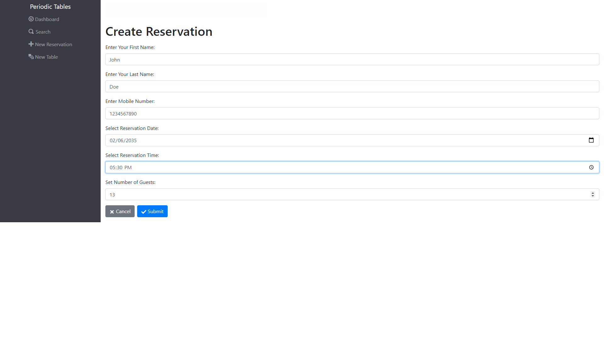
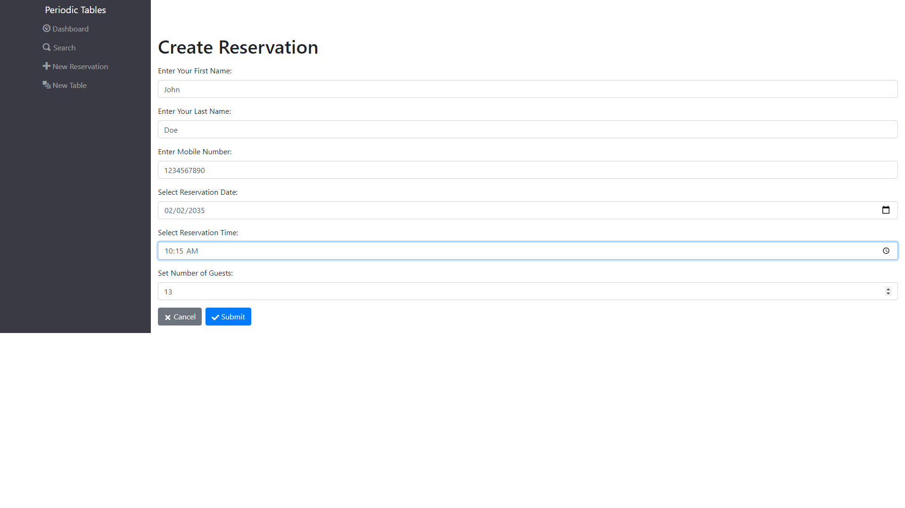
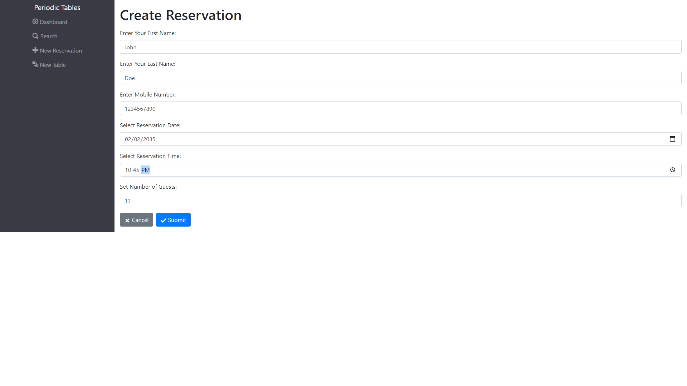
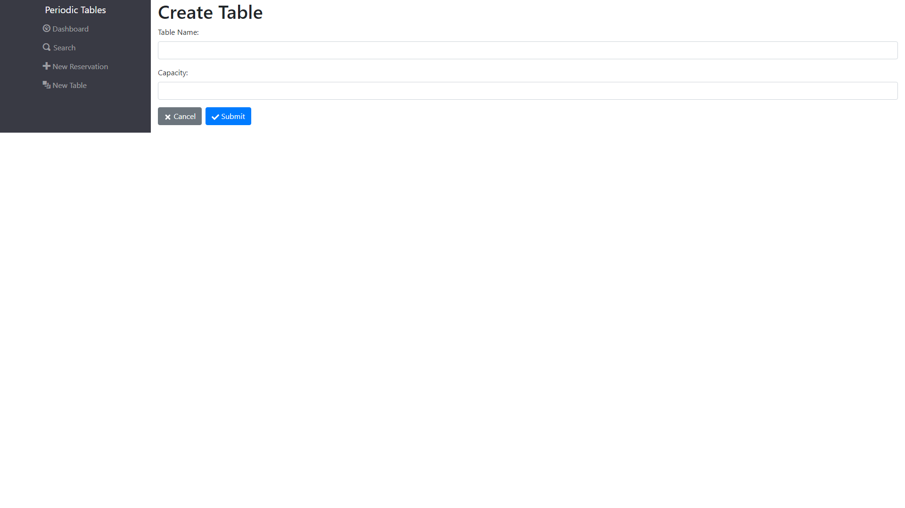
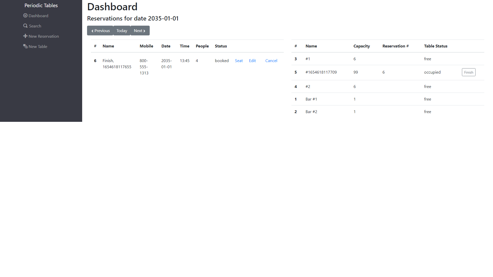
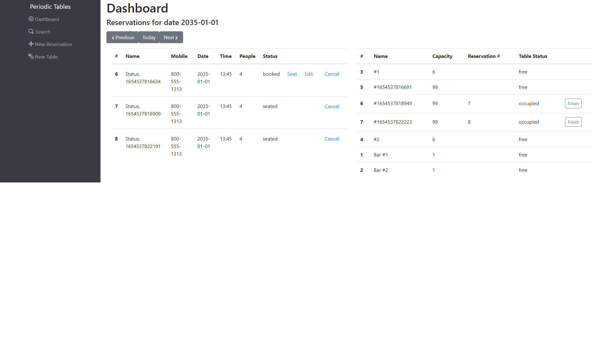

<<<<<<< HEAD
# restaurant-client

/das
# Capstone: Restaurant Reservation System Backend

This starter code for the backend of the capstone project in the Thinkful curriculum.

See [../README.md](../README.md) for detailed instructions.

=======
# restaurant-client

/das
# Capstone: Restaurant Reservation System Backend

This starter code for the backend of the capstone project in the Thinkful curriculum.

See [../README.md](../README.md) for detailed instructions.
>>>>>>> c61b6c5bf965fbcb5fa48cdf3ea14918af04e004
